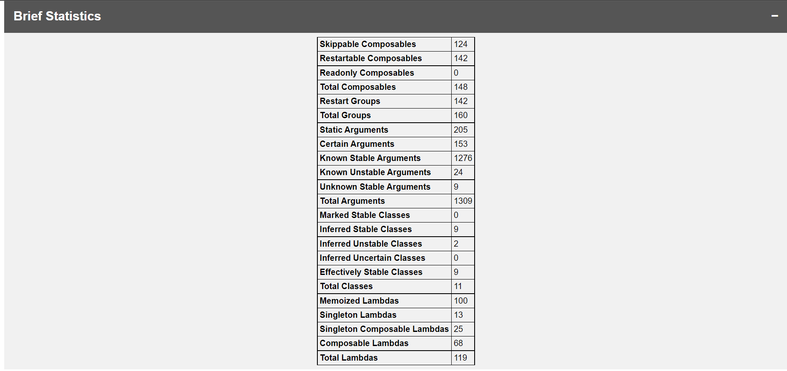
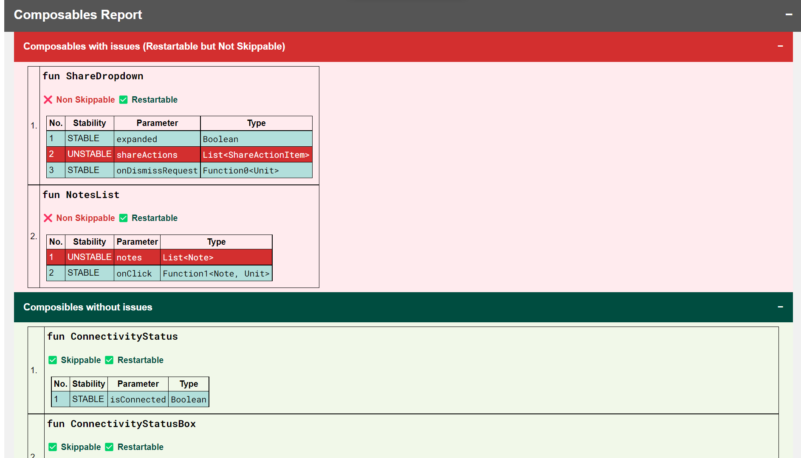
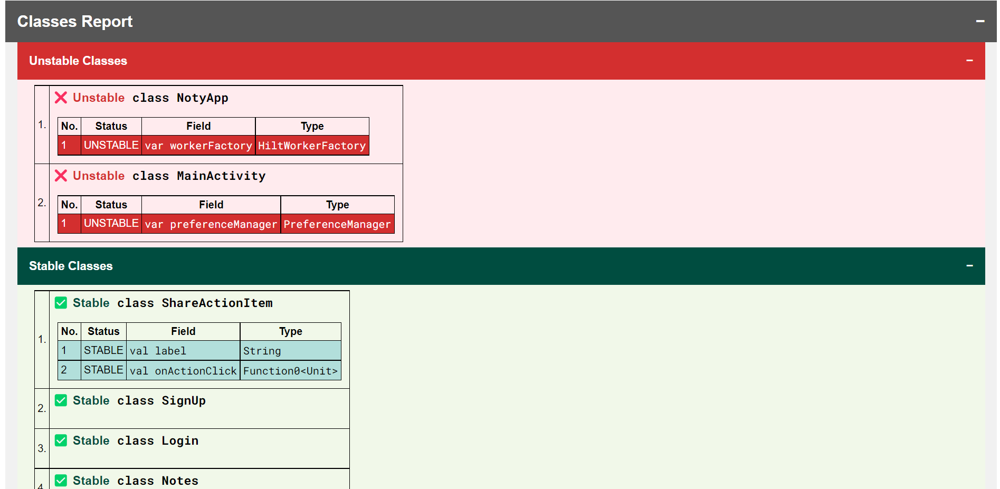

# Compose Compiler Reports to HTML Generator

A CLI utility to convert Jetpack Compose compiler metrics and reports to beautified 😍 HTML page.
_Made with ❤️ for Android Developers and Composers_

[](https://github.com/PatilShreyas/compose-report-to-html/actions/workflows/build.yml)
[](https://github.com/PatilShreyas/compose-report-to-html/actions/workflows/release.yml)

|                   | **Install**                                                                                                                                                                                                                                                           |
|-------------------|-----------------------------------------------------------------------------------------------------------------------------------------------------------------------------------------------------------------------------------------------------------------------|
| **Gradle Plugin** | [](https://plugins.gradle.org/plugin/dev.shreyaspatil.compose-compiler-report-generator) |
| **NPM**           | [](https://www.npmjs.com/package/compose-report2html)                                                                                                                              |
| **JAR**           | [](https://github.com/patilshreyas/compose-report-to-html/releases/latest/download/composeReport2Html.jar)                                            |
| **Maven**         | [](https://search.maven.org/search?q=g:dev.shreyaspatil.compose-compiler-report-generator)             |


## 🧑‍💻 Usage

## Utility as a library

This utility is also published as a maven artifact on Maven Central so that you can make use of it as you want to use it
(_For example: automation in CI_).

Refer to the Wiki for more information: [**Using this utility as a library**](https://github.com/PatilShreyas/compose-report-to-html/wiki/Using-utility-as-a-library)

## 📈 Report Overview

Once report is generated, it looks like this.

| **Title**               | **Preview**                                                                                                                                                                                           |
|-------------------------|-------------------------------------------------------------------------------------------------------------------------------------------------------------------------------------------------------|
| **Brief Statistics**    | Generates metrics from `.json` file and represents in tabular format. <br><br>                                                                             |
| **Detailed Statistics** | Generates report from `.csv` file and represents in tabular format. <br><br>                                                                         |
| **Composable Report**   | Parses `-composables.txt` file and separates out composables with and without issues and properly highlights issues associated with them. <br><br>  |
| **Class Report**        | Parses `-classes.txt` file and separates out stable and unstable classes out of it and properly highlights issues associated with them. <br><br>              |

Right now, work is in progress and more improvements related to the report
will happen in some time. If you have any feedback / suggestions related to
the report, feel free to discuss it (_find discussion link in the below section_).

## 🙋‍♂️ Contribute

Read [contribution guidelines](CONTRIBUTING.md) for more information regarding contribution.

## 💬 Discuss?

Have any questions, doubts or want to present your opinions, views? You're always welcome. You
can [start discussions](https://github.com/PatilShreyas/compose-report-to-html/discussions).

## License

```
MIT License

Copyright (c) 2022 Shreyas Patil

Permission is hereby granted, free of charge, to any person obtaining a copy
of this software and associated documentation files (the "Software"), to deal
in the Software without restriction, including without limitation the rights
to use, copy, modify, merge, publish, distribute, sublicense, and/or sell
copies of the Software, and to permit persons to whom the Software is
furnished to do so, subject to the following conditions:

The above copyright notice and this permission notice shall be included in all
copies or substantial portions of the Software.

THE SOFTWARE IS PROVIDED "AS IS", WITHOUT WARRANTY OF ANY KIND, EXPRESS OR
IMPLIED, INCLUDING BUT NOT LIMITED TO THE WARRANTIES OF MERCHANTABILITY,
FITNESS FOR A PARTICULAR PURPOSE AND NONINFRINGEMENT. IN NO EVENT SHALL THE
AUTHORS OR COPYRIGHT HOLDERS BE LIABLE FOR ANY CLAIM, DAMAGES OR OTHER
LIABILITY, WHETHER IN AN ACTION OF CONTRACT, TORT OR OTHERWISE, ARISING FROM,
OUT OF OR IN CONNECTION WITH THE SOFTWARE OR THE USE OR OTHER DEALINGS IN THE
SOFTWARE.
```
