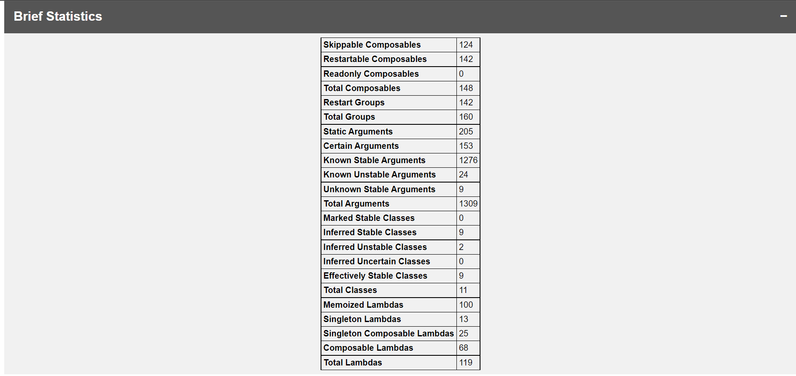
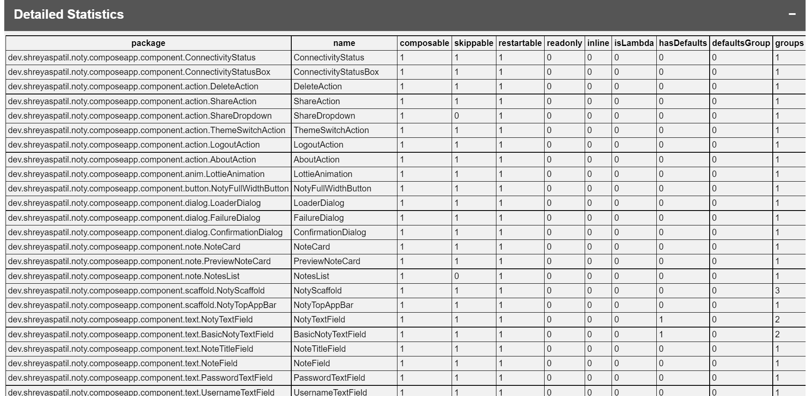
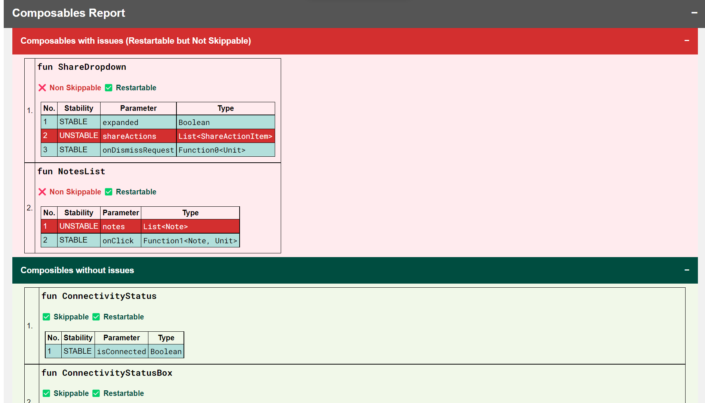
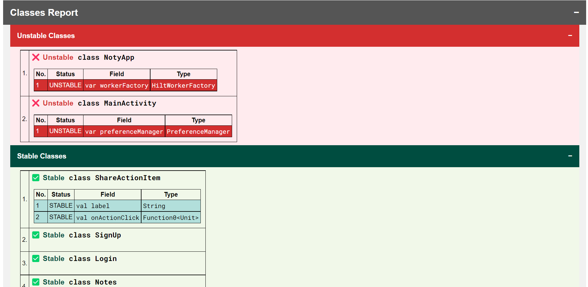

# Compose Compiler Reports to HTML Generator

A CLI (_Command Line Interface_) utility to convert Jetpack Compose metrics and reports to beautified HTML page 😍. 
_Made with ❤️ for Android Developers and Composers_

[](https://www.npmjs.com/package/compose-report2html)
[](https://www.npmjs.com/package/compose-report2html)

[](https://github.com/patilshreyas/compose-report-to-html/releases/latest/download/composeReport2Html.jar)
[](https://github.com/patilshreyas/compose-report-to-html/releases/latest/download/composeReport2Html.jar)

[](https://github.com/PatilShreyas/compose-report-to-html/actions/workflows/build.yml)
[](https://github.com/PatilShreyas/compose-report-to-html/actions/workflows/release.yml)

[](https://github.com/PatilShreyas)
[](https://github.com/PatilShreyas/compose-report-to-html/stargazers)
[](https://github.com/PatilShreyas/compose-report-to-html/network/members)
[](https://github.com/PatilShreyas/compose-report-to-html/watchers)
[](https://twitter.com/imShreyasPatil)

## 💡 Motivation 

The Compose Compiler plugin can generate reports / metrics around certain compose-specific concepts that can be useful to understand what is happening with some of your compose code at a fine-grained level.
[_**See this**_](https://github.com/androidx/androidx/blob/androidx-main/compose/compiler/design/compiler-metrics.md).  

This generates reports in `json`, `csv` and `txt` files which are not easily trace-able for developers.
Also, Composable function and class reports becomes large and tedious to check.
This tool parses the reports and metrics generated by Compose compiler and beautifies into a HTML page by intelligently distinguishes problematic and non-problematic composable functions and classes.

## 🧑‍💻 Usage

First, install the CLI utility

### 1. Install CLI

To install the CLI utility, there are two ways

#### 1.1 Directly use `.jar` distribution

Navigate to the [releases](https://github.com/PatilShreyas/compose-report-to-html/releases) and download the latest JAR artifact.

#### 1.2 Install from NPM

Install the [NPM package](https://www.npmjs.com/package/compose-report2html) for CLI utility.

```shell
npm install -g compose-report2html
```

### 2. Know usage

Run the commands to know the usage of CLI

#### 2.1 If using JAR artifact

```shell
java -jar composeReport2Html.jar -h
```

#### 2.2 If using NPM package

If you have installed CLI utility from NPM package, it can be directly available from Terminal.

```shell
composeReport2Html.jar -h
```

Once you run, here's how it looks.

```shell
Usage: Compose Compiler Report to HTML Generator options_list
Options:
    --applicationName, -app -> Application name (To be displayed in the report) (always required) { String }
    --overallStatsFile, -overallStatsReport -> Overall Statistics Metrics JSON file (always required) { String }
    --detailedStatsFile, -detailedStatsMetrics -> Detailed Statistics Metrics CSV file (always required) { String }
    --composableMetricsFile, -composableMetrics -> Composable Metrics TXT file (always required) { String }
    --classMetricsFile, -classMetrics -> Class Metrics TXT file (always required) { String }
    --outputDirectory, -o -> Output directory name (always required) { String }
    --help, -h -> Usage info
```

### 3. Generate report

```shell
java -jar composeReport2Html.jar \
  -app <YOUR_APP_NAME> \
  -overallStatsReport <PATH TO *-module.json FILE> \
  -detailedStatsMetrics <PATH TO *-composables.csv FILE> \
  -composableMetrics <PATH TO *-composables.txt FILE> \
  -classMetrics <PATH TO *-classes.txt FILE> \
  -o <OUTPUT DIRECTORY PATH FOR REPORT>
```

***Example Usage:***

```shell
java -jar composeReport2Html.jar \
  -app NotyKT \
  -overallStatsReport app_release-module.json \
  -detailedStatsMetrics app_release-composables.csv \
  -composableMetrics app_release-composables.txt \
  -classMetrics app_release-classes.txt \
  -o notyReport
```

In the above example, it will create report with name **"NotyKT"** with specified metric and report files and finally report will be generated in the specified path i.e. `notyReport/index.html`.

## 📈 Report Overview 

Once report is generated, it looks like this

| **Title**               | **Comments**                                                                                                                              | **Demo**                                           |
|-------------------------|-------------------------------------------------------------------------------------------------------------------------------------------|----------------------------------------------------|
| **Brief Statistics**    | Generates metrics from `.json` file and represents in tabular format.                                                                     |         |
| **Detailed Statistics** | Generates report from `.csv` file and represents in tabular format.                                                                       |   |
| **Composable Report**   | Parses `-composables.txt` file and separates out composables with and without issues and properly highlights issues associated with them. |  |
| **Class Report**        | Parses `-classes.txt` file and separates out stable and unstable classes out of it and properly highlights issues associated with them.   |            |

## 🙋‍♂️ Contribute

Read [contribution guidelines](CONTRIBUTING.md) for more information regarding contribution.

## 💬 Discuss?

Have any questions, doubts or want to present your opinions, views? You're always welcome. You can [start discussions](https://github.com/PatilShreyas/compose-report-to-html/discussions).

## License

```
MIT License

Copyright (c) 2022 Shreyas Patil

Permission is hereby granted, free of charge, to any person obtaining a copy
of this software and associated documentation files (the "Software"), to deal
in the Software without restriction, including without limitation the rights
to use, copy, modify, merge, publish, distribute, sublicense, and/or sell
copies of the Software, and to permit persons to whom the Software is
furnished to do so, subject to the following conditions:

The above copyright notice and this permission notice shall be included in all
copies or substantial portions of the Software.

THE SOFTWARE IS PROVIDED "AS IS", WITHOUT WARRANTY OF ANY KIND, EXPRESS OR
IMPLIED, INCLUDING BUT NOT LIMITED TO THE WARRANTIES OF MERCHANTABILITY,
FITNESS FOR A PARTICULAR PURPOSE AND NONINFRINGEMENT. IN NO EVENT SHALL THE
AUTHORS OR COPYRIGHT HOLDERS BE LIABLE FOR ANY CLAIM, DAMAGES OR OTHER
LIABILITY, WHETHER IN AN ACTION OF CONTRACT, TORT OR OTHERWISE, ARISING FROM,
OUT OF OR IN CONNECTION WITH THE SOFTWARE OR THE USE OR OTHER DEALINGS IN THE
SOFTWARE.
```