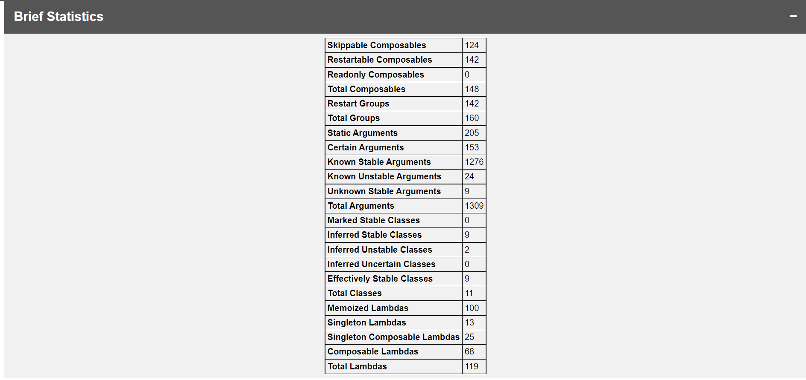

---
hide:
- toc
---

# Compose Compiler Report to HTML

A utility (**Gradle Plugin + CLI**) to convert Jetpack Compose compiler metrics and reports to beautified 😍 HTML page. 
_Made with ❤️ for Android Developers and Composers_

## 💡 Motivation

The Compose Compiler plugin can generate reports / metrics around certain compose-specific concepts that can be useful
to understand what is happening with some of your compose code at a fine-grained level.
[_**See this**_](https://github.com/androidx/androidx/blob/androidx-main/compose/compiler/design/compiler-metrics.md)
to understand this concept in detail.

This generates reports in `json`, `csv` and `txt` files which are not easily trace-able for developers.
Also, Composable function and class reports becomes large and tedious to check.
This tool parses the reports and metrics generated by Compose compiler and beautifies into a HTML page and intelligently
distinguishes problematic and non-problematic composable functions and classes.

_This utility doesn't generate Compose Metrics and Reports on its own.
First, raw Compose report should be generated from the Compose Compiler and those generated files should be feed to
this utility. By parsing that data, this utility generates the beautified report._

## 📈 How it looks?

Once report is generated, it looks like this. 
This is overall Report Overview:

| **Title**               | **Preview**                                                                                                                                                                                           |
|-------------------------|-------------------------------------------------------------------------------------------------------------------------------------------------------------------------------------------------------|
| **Brief Statistics**    | Generates metrics from `.json` file and represents in tabular format.                                                                                |
| **Detailed Statistics** | Generates report from `.csv` file and represents in tabular format.                                                                            |
| **Composable Report**   | Parses `-composables.txt` file and separates out composables with and without issues and properly highlights issues associated with them.     |
| **Class Report**        | Parses `-classes.txt` file and separates out stable and unstable classes out of it and properly highlights issues associated with them.                 |

Right now, work is in progress and more improvements related to the report
will happen in some time. If you have any feedback / suggestions related to
the report, feel free to [discuss](https://github.com/PatilShreyas/compose-report-to-html/discussions).
