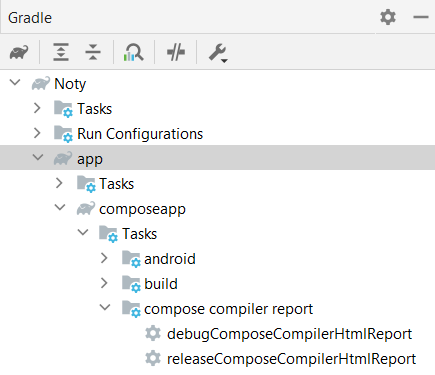

# Gradle Plugin

Using the Gradle Plugin, you can fully automate the process of generating the report without any overhead.  
This Gradle plugin takes care of generating raw compose metrics and report from the Compose compiler and then 
generates the beautified report from them.

## ✅ Apply the plugin

Apply the plugin to the module in which _**compose is enabled**_.

!!! info

    Check the latest plugin release: 
    [](https://plugins.gradle.org/plugin/dev.shreyaspatil.compose-compiler-report-generator)

### Using the plugins DSL:

=== "Groovy"

    ```groovy title="build.gradle"
    plugins {
      id "dev.shreyaspatil.compose-compiler-report-generator" version "1.3.1"
    }
    ```

=== "Kotlin"

    ```kotlin title="build.gradle.kts"
    plugins {
      id("dev.shreyaspatil.compose-compiler-report-generator") version "1.3.1"
    }    
    ```

### Using legacy plugin application:

Add this to top project level `build.gradle`

=== "Groovy"

    ```groovy title="build.gradle"
    buildscript {
      repositories {
        maven {
          url "https://plugins.gradle.org/m2/"
        }
      }
      dependencies {
        classpath "dev.shreyaspatil.compose-compiler-report-generator:gradle-plugin:1.3.1"
      }
    }
    ```

    Apply in the module level project:

    ```groovy
    apply plugin: "dev.shreyaspatil.compose-compiler-report-generator"
    ```

=== "Kotlin"

    ```kotlin title="build.gradle.kts"
    buildscript {
      repositories {
        maven {
          url = uri("https://plugins.gradle.org/m2/")
        }
      }
      dependencies {
        classpath("dev.shreyaspatil.compose-compiler-report-generator:gradle-plugin:1.3.1")
      }
    }
    ```
    
    Apply in the module level project:

    ```kotlin
    apply(plugin = "dev.shreyaspatil.compose-compiler-report-generator")
    ```

## 💫 Sync the project 

Once plugin is applied, sync the project. After the project is synced, tasks for generating compose report will be 
generated for the variants and flavors used in the project.

!!! example
    
    { height="150" }

## 🪄 Generate report

Run the Gradle task (_or directly run the task from tasks pane available on the right side of IDE_)

```shell
./gradlew :app:releaseComposeCompilerHtmlReport
```

If report is generated successfully, the path to report will be logged in the console

!!! example "Example (Console output)"

    ```shell
    Compose Compiler report is generated: .../noty-android/app/composeapp/build/compose_report/index.html
    
    BUILD SUCCESSFUL in 58s
    1 actionable task: 1 executed
    ```

## ⚙️ Configure parameters for plugin (Optional)

If you have to configure plugin parameters manually (which is completely optional), it can be configured as follows:

=== "Groovy"

    ```groovy title="build.gradle"
    htmlComposeCompilerReport {
        // Enables metrics generation from the compose compiler
        enableMetrics = true/false // Default: `true`
    
        // Enables report generation from the compose compiler
        enableReport = true/false // Default: `true`
        
        // Sets the name for a report
        name = "Report Name" // Default: Module name
    
        // Output directory where report will be generated
        outputDirectory = layout.buildDirectory.dir("custom_dir").get().asFile // Default: module/buildDir/compose_report
        
        // Whether to include stable composable functions in the final report or not.
        includeStableComposables = true/false // Default: true

        // Whether to include stable classes in the final report or not.
        includeStableClasses = true/false // Default: true

        // Whether to include the ALL classes in the final report or not.
        includeClasses = true/false // Default: true

        // ONLY show unstable composables in the report without stats and classes
        showOnlyUnstableComposables = true/false // Default: false
    }
    ```

=== "Kotlin"
    
    ```kotlin title="build.gradle.kts"
    htmlComposeCompilerReport {
        // Enables metrics generation from the compose compiler
        enableMetrics.set(true/false) // Default: `true`
    
        // Enables report generation from the compose compiler
        enableReport.set(true/false) // Default: `true`
    
        // Sets the name for a report
        name.set("Report Name") // Default: Module name
    
        // Output directory where report will be generated
        outputDirectory.set(layout.buildDirectory.dir("custom_dir").get().asFile) // Default: module/buildDir/compose_report

        // Whether to include stable composable functions in the final report or not.
        includeStableComposables.set(true/false) // Default: true

        // Whether to include stable classes in the final report or not.
        includeStableClasses.set(true/false) // Default: true

        // Whether to include the ALL classes in the final report or not.
        includeClasses.set(true/false) // Default: true

        // ONLY show unstable composables in the report without stats and classes
        showOnlyUnstableComposables.set(true/false) // Default: false
    }
    ```